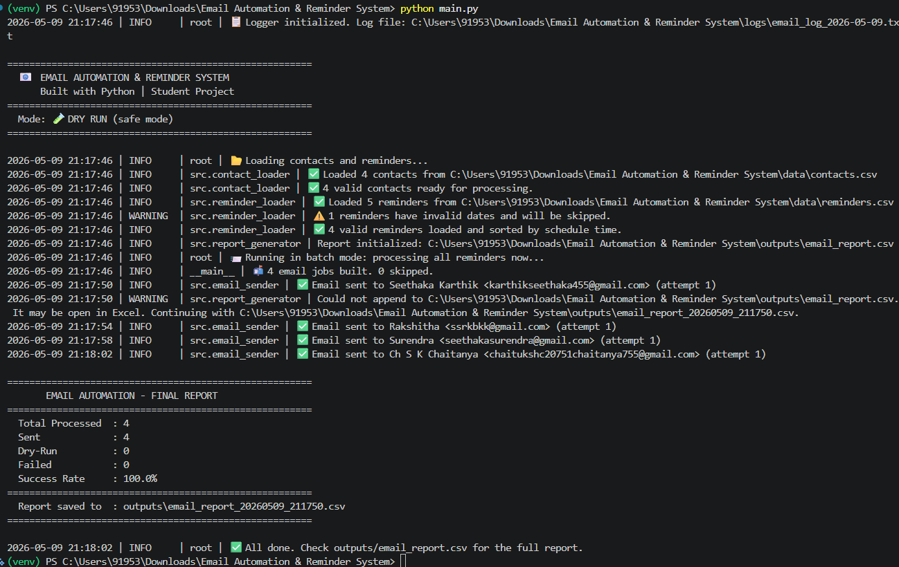

# 📧 Email Automation & Reminder System

> A production-style Python automation project that reads contacts from CSV,
> personalizes email templates, schedules reminders, sends emails via SMTP,
> and generates detailed CSV reports — all with safe dry-run simulation.

---

## 🏢 Industry Relevance

| Team | Use Case |
|---|---|
| HR | Send performance review deadlines, onboarding reminders |
| Sales | Follow-up reminders for leads and proposals |
| Operations | Task completion alerts, daily report reminders |
| Finance | Invoice payment due reminders |
| Training | Webinar registration, course deadline alerts |
| Admin | Meeting reminders, schedule notifications |

Real companies use tools like Mailchimp, HubSpot, and Salesforce for exactly this —
this project builds the same logic from scratch in Python.

---

## 🎯 Problem Statement

Manual email reminders are:
- **Time-consuming** — HR/Ops teams send the same reminder emails every week
- **Error-prone** — Wrong names, dates, or missed contacts
- **Unscalable** — 500 contacts cannot be emailed one-by-one

This system automates the entire pipeline:
`Contact CSV → Template → Schedule → Send → Log → Report`

---

## ✨ Features

- ✅ **CSV-based contact management** — no database needed
- ✅ **6 email template types** — meeting, deadline, follow-up, task, payment, webinar
- ✅ **Personalized emails** — Name, role, department auto-filled per contact
- ✅ **Dry-run mode** — Simulate everything safely without sending real emails
- ✅ **Live scheduler** — Sends reminders automatically at the right date/time
- ✅ **Batch mode** — Process all reminders in one go
- ✅ **SMTP support** — Works with Gmail (and any SMTP provider)
- ✅ **Retry logic** — Automatically retries failed sends up to 3 times
- ✅ **Detailed logging** — Timestamped logs saved to `logs/`
- ✅ **CSV report** — Full audit trail of sent/failed/dry-run emails
- ✅ **Secure credentials** — Uses `.env` file, never hardcoded

---

## 🛠️ Tech Stack

| Tool | Purpose |
|---|---|
| Python 3.10+ | Core language |
| Pandas | CSV reading and data manipulation |
| smtplib | Email sending via SMTP |
| email.message | Composing email objects |
| schedule | Minute-by-minute reminder scheduling |
| python-dotenv | Safe credential loading from .env |
| logging | Detailed log file generation |
| argparse | CLI mode switching |
| csv | Report file writing |
| datetime | Time-based scheduling |

---

## 📁 Folder Structure

```
Email-Automation-Reminder-System/
│
├── data/
│   ├── contacts.csv          # Contact list (name, email, dept, role)
│   └── reminders.csv         # Reminder schedule (who, what, when)
│
├── templates/
│   ├── meeting_reminder.txt
│   ├── deadline_reminder.txt
│   ├── followup_reminder.txt
│   ├── task_reminder.txt
│   ├── payment_reminder.txt
│   └── webinar_reminder.txt
│
├── src/
│   ├── __init__.py
│   ├── config.py             # All settings and env variable loading
│   ├── contact_loader.py     # Read and validate contacts CSV
│   ├── reminder_loader.py    # Read and parse reminders CSV
│   ├── template_engine.py    # Load templates and personalize them
│   ├── email_sender.py       # SMTP sending with retry and dry-run
│   ├── scheduler.py          # Live minute-by-minute scheduler
│   ├── report_generator.py   # CSV report and terminal summary
│   └── logger_setup.py       # Logging to console + file
│
├── outputs/
│   └── email_report.csv      # Generated report of all email activity
│
├── logs/
│   └── email_log_YYYY-MM-DD.txt  # Daily log files
│
├── docs/
│   └── architecture.md       # Architecture notes
│
├── images/                   # Screenshots for README
│
├── main.py                   # Entry point — run this!
├── requirements.txt
├── .env.example              # Template for credentials (safe to commit)
├── .gitignore
└── README.md
```

---

## ⚙️ Setup Instructions

### Step 1 — Clone the Repository

```bash
git clone https://github.com/YOUR_USERNAME/Email-Automation-Reminder-System.git
cd Email-Automation-Reminder-System
```

### Step 2 — Create Virtual Environment

```bash
# Windows
python -m venv venv
venv\Scripts\activate

# macOS / Linux
python3 -m venv venv
source venv/bin/activate
```

### Step 3 — Install Dependencies

```bash
pip install -r requirements.txt
```

### Step 4 — Configure Environment Variables

```bash
# Copy the example file
cp .env.example .env

# Open .env and fill in your Gmail credentials
```

Your `.env` file should look like:

```env
SMTP_HOST=smtp.gmail.com
SMTP_PORT=587
SENDER_EMAIL=your_email@gmail.com
SENDER_PASSWORD=your_16_char_app_password
SENDER_NAME=Email Automation System
DRY_RUN=true
```

> **⚠️ How to get a Gmail App Password:**
> 1. Go to [myaccount.google.com](https://myaccount.google.com)
> 2. Security → 2-Step Verification → Enable
> 3. Security → App Passwords → Generate for "Mail"
> 4. Copy the 16-character password

---

## 🚀 How to Run

### Option 1 — Dry Run (Safe, Recommended for Testing)

```bash
python main.py
```

No real emails sent. Simulates the full pipeline. Perfect for GitHub demo.

### Option 2 — Process All Reminders Now (Dry Run)

```bash
python main.py --all
```

### Option 3 — Send Real Emails

```bash
# First set DRY_RUN=false in your .env file, then:
python main.py --send
```

### Option 4 — Start Live Scheduler

```bash
# Checks every minute and sends emails at scheduled times
python main.py --schedule
```

### Option 5 — Live Scheduler + Real Emails

```bash
python main.py --schedule --send
```

---

## 📊 Output

### Terminal Output 



### Generated CSV Report (`outputs/email_report.csv`)

| timestamp | reminder_id | contact_name | to_email | reminder_type | subject | status |
|---|---|---|---|---|---|---|
|2026-05-09| 21:17:50|R001|Seethaka Karthik|karthikseethaka455@gmail.com|meeting|Team Standup Meeting - Action Required,2024-12-20 09:00:00,sent,1|Email delivered successfully on attempt 1.
|2026-05-09| 21:17:54|R002|Rakshitha|ssrkbkk@gmail.com|deadline,Performance| Review Submission Deadline,2024-12-20 10:00:00,sent,1|Email delivered successfully on attempt 1.
|2026-05-09| 21:17:58|R003|Surendra|seethakasurendra@gmail.com|followup|Follow-up: Q4 Sales Proposal,2024-12-20 11:00:00,sent,1|Email delivered successfully on attempt 1.
|2026-05-09| 21:18:02|R004|Ch S K Chaitanya|chaitukshc20751chaitanya755@gmail.com|task,Ops |Dashboard Report Due,2024-12-20 14:00:00,sent,1|Email delivered successfully on attempt 1.

---

## 🔄 Architecture & Workflow

```
┌─────────────────────────────────────────────────────┐
│              EMAIL AUTOMATION SYSTEM                 │
│                                                     │
│  INPUT LAYER                                        │
│  ┌──────────────┐  ┌──────────────┐  ┌───────────┐ │
│  │ contacts.csv │  │reminders.csv │  │ templates/│ │
│  └──────┬───────┘  └──────┬───────┘  └─────┬─────┘ │
│         │                 │                │        │
│  PROCESSING LAYER         │                │        │
│  ┌──────▼───────────────────────────────────▼─────┐ │
│  │  contact_loader → reminder_loader →             │ │
│  │  template_engine → personalized_email           │ │
│  └─────────────────────┬───────────────────────────┘ │
│                        │                            │
│  SENDING LAYER         │                            │
│  ┌─────────────────────▼───────────────────────────┐ │
│  │  email_sender (SMTP / Dry-Run) + scheduler      │ │
│  └─────────────────────┬───────────────────────────┘ │
│                        │                            │
│  OUTPUT LAYER          │                            │
│  ┌─────────────────────▼───────────────────────────┐ │
│  │  logs/email_log.txt + outputs/email_report.csv  │ │
│  └────────────────────────────────────────────────┘ │
└─────────────────────────────────────────────────────┘
```

---

## 📚 Learning Outcomes

After completing this project you will know how to:

- Read and process CSV files with Pandas
- Build a modular Python project with separate concerns
- Use Python's `smtplib` and `email.message` for real email sending
- Implement dry-run / simulation mode in automation systems
- Schedule tasks using the `schedule` library
- Load credentials safely with `python-dotenv`
- Implement retry logic for network failures
- Generate structured CSV reports programmatically
- Write professional Python logging
- Organize a Python project for GitHub

---

## 🏷️ GitHub Tags

`python` `automation` `email-automation` `smtp` `pandas` `schedule` `reminder-system`
`csv` `logging` `productivity` `operations` `hr-automation` `student-project`

---

## 📜 License

MIT License — Free to use, modify, and share.

---

*Built as a Python course project demonstrating real-world automation skills.*
*Author: [Your Name] | GitHub: [Your GitHub Profile]*
